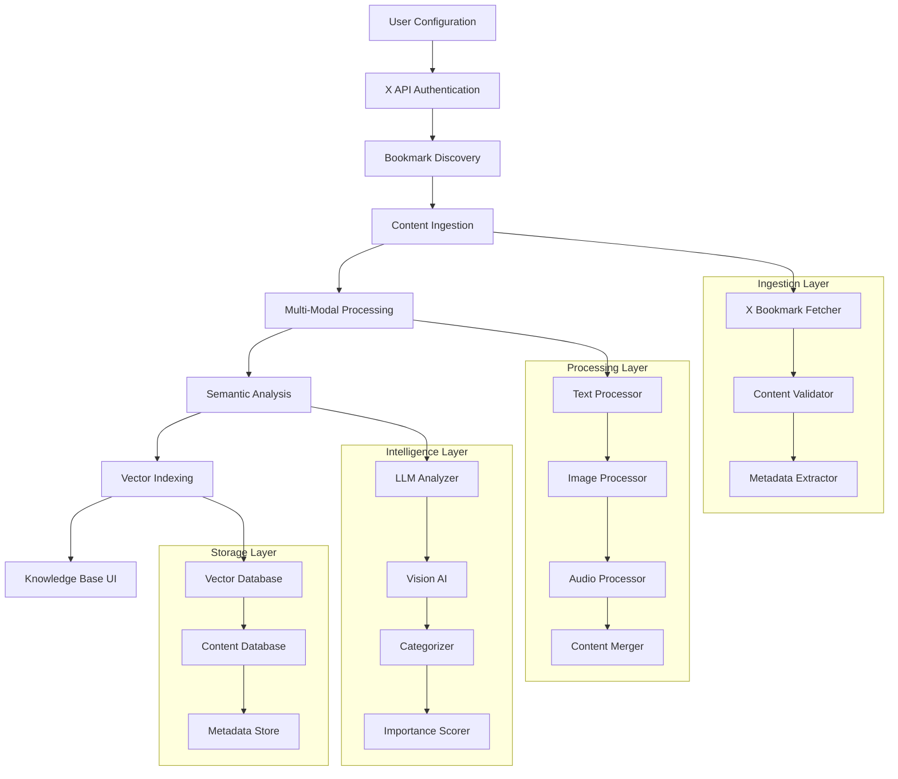
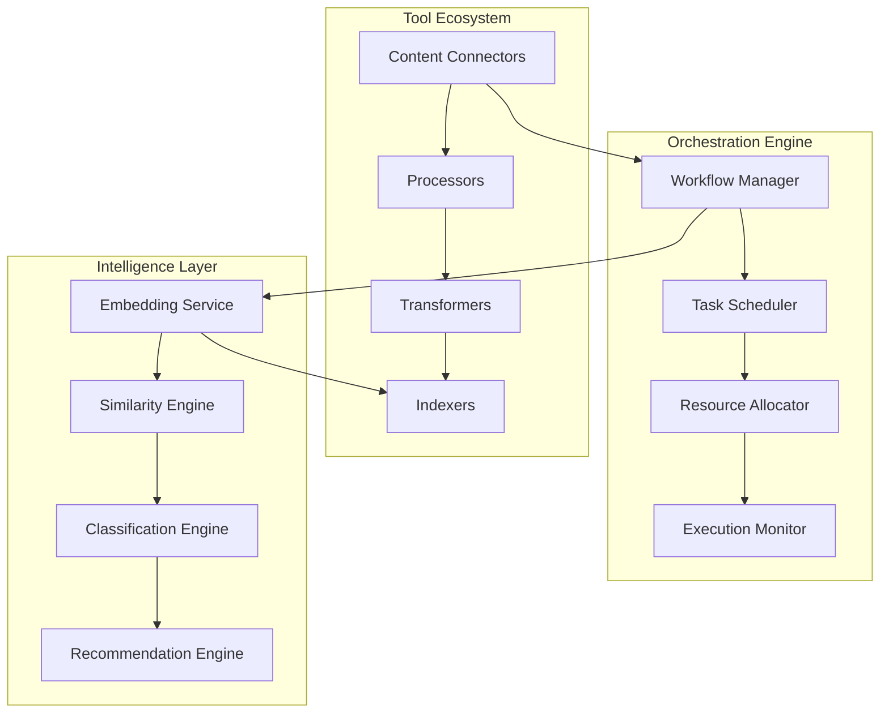
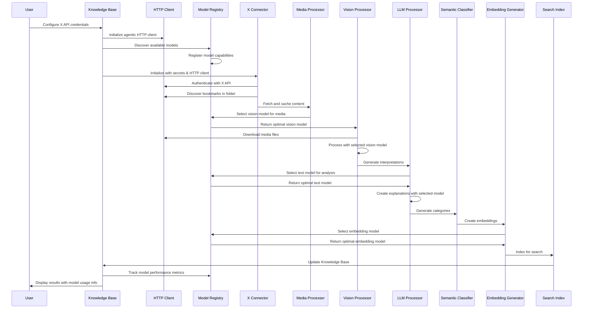
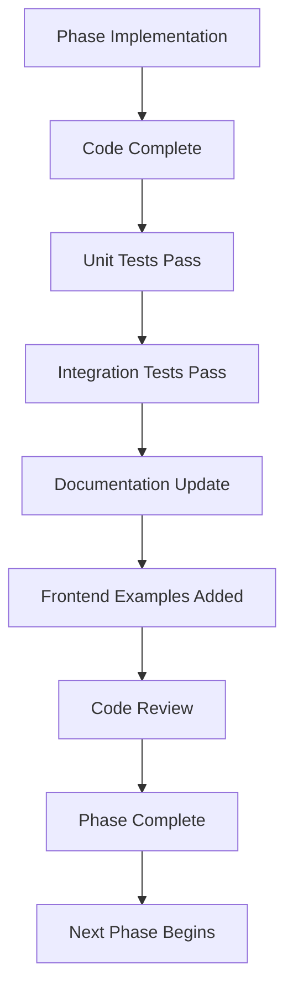

# 🚀 **Agentic Knowledge Base: Composable Semantic Orchestration Project Plan**

## 📋 **Executive Summary**

This project transforms our existing 85% complete backend into a **composable, multi-modal content processing platform** that supports the Knowledge Base workflow while enabling unlimited future use cases. By leveraging modern agentic design patterns, we'll create a **semantic content orchestration engine** that can handle text, images, audio, and structured data through reusable, chainable components.

**Key Outcomes:**
- ✅ Knowledge Base workflow fully implemented
- ✅ Reusable framework for future AI workflows
- ✅ Multi-modal content processing capabilities
- ✅ Semantic search and intelligent categorization
- ✅ Production-ready with comprehensive monitoring

---

## 🏗️ **Architecture Overview**

### **Core Design Philosophy: Composable Semantic Orchestration**

```
┌─────────────────────────────────────────────────────────────────┐
│                    SEMANTIC CONTENT ORCHESTRATOR                 │
│  ┌─────────────────────────────────────────────────────────────┐ │
│  │                 WORKFLOW ORCHESTRATION ENGINE               │ │
│  │  ┌─────────────┬─────────────┬─────────────┬─────────────┐  │ │
│  │  │  INGESTION │ PROCESSING  │ INDEXING    │  SEARCH     │  │ │
│  │  │   LAYER    │   LAYER     │   LAYER     │   LAYER     │  │ │
│  │  └─────────────┴─────────────┴─────────────┴─────────────┘  │ │
│  └─────────────────────────────────────────────────────────────┘ │
│  ┌─────────────────────────────────────────────────────────────┐ │
│  │                 MULTI-MODAL TOOL ECOSYSTEM                  │ │
│  │  ┌─────────────┬─────────────┬─────────────┬─────────────┐  │ │
│  │  │   TEXT      │   IMAGE     │   AUDIO     │ STRUCTURED  │  │ │
│  │  │ PROCESSORS  │ PROCESSORS  │ PROCESSORS  │ PROCESSORS  │  │ │
│  │  └─────────────┴─────────────┴─────────────┴─────────────┘  │ │
│  └─────────────────────────────────────────────────────────────┘ │
└─────────────────────────────────────────────────────────────────┘
```

### **Modern Agentic Design Principles Applied**

1. **🔗 Composability First**: Every component is a reusable, chainable unit
2. **📊 Event-Driven Architecture**: Pub/sub system for loose coupling
3. **🧩 Plugin Architecture**: Easy registration of new capabilities
4. **⚡ Semantic Processing**: Embeddings and vector operations throughout
5. **🔄 Workflow Orchestration**: DAG-based execution with intelligent routing
6. **📈 Observability**: Comprehensive telemetry and performance monitoring
7. **🛡️ Resilience Patterns**: Circuit breakers, retries, graceful degradation
8. **🔍 Content-Aware Processing**: Automatic content type detection and routing
9. **🌐 Agentic HTTP Client**: Resilient web interactions with intelligent error handling
10. **🧠 Dynamic Model Selection**: AI-powered model selection based on task requirements
11. **📊 Performance-Driven Intelligence**: Continuous learning from model performance data

---

## 🎯 **Implementation Phases**

### **Phase 1: Foundation Enhancement (3 weeks)**
**Goal**: Strengthen core infrastructure for advanced workflows

#### **1.1 Enhanced Workflow Orchestration Engine**
- **DAG Execution Engine**: Replace linear pipelines with dependency graphs
- **Dynamic Routing**: Content-aware step selection based on data characteristics
- **Parallel Processing**: Concurrent execution of independent workflow steps
- **State Management**: Persistent workflow state with recovery capabilities

#### **1.2 Agentic HTTP Client Framework**
- **Resilient HTTP Client**: Circuit breaker pattern, retry logic, timeout handling
- **Rate Limiting**: Configurable rate limits with backoff strategies
- **Request/Response Observability**: Comprehensive logging and metrics collection
- **Authentication Integration**: Support for API keys, OAuth, JWT, and custom auth
- **Content-Type Handling**: Automatic serialization/deserialization for JSON, XML, form data
- **Streaming Support**: Large file downloads and real-time data streams
- **Security Features**: SSL/TLS validation, proxy support, certificate handling

#### **1.3 Dynamic Model Selection System**
- **Model Registry Service**: Automatic discovery and registration of available Ollama models
- **Model Capability Mapping**: Track model capabilities (vision, text, audio, embeddings)
- **Performance Tracking**: Monitor model performance metrics and usage patterns
- **Intelligent Selection**: Content-aware model selection based on task requirements
- **Fallback Mechanisms**: Automatic fallback to alternative models on failure
- **Model Versioning**: Track model versions and performance over time

#### **1.4 Multi-Modal Content Framework**
- **Content Type Detection**: Automatic MIME type and content analysis
- **Unified Content Model**: Abstract interface for all content types
- **Metadata Enrichment**: Automatic extraction of content metadata
- **Caching Layer**: Intelligent caching with invalidation strategies

#### **1.5 Semantic Processing Infrastructure**
- **Embedding Service**: Unified interface for multiple embedding models
- **Vector Operations**: Similarity search, clustering, and classification
- **Content Chunking**: Intelligent text and media segmentation
- **Quality Scoring**: Automatic assessment of content processing results
- **Model Usage Tracking**: Record which models were used for each processing task

#### **1.6 Documentation Update**
- **Update API_DOCUMENTATION.md**: Add comprehensive documentation for Agentic HTTP Client Framework and Dynamic Model Selection System
- **Create Frontend Integration Guide**: Document React hooks and integration patterns for new HTTP and model selection features
- **Add Code Examples**: Include practical examples for HTTP client usage and model selection in frontend applications
- **Update Testing Examples**: Add new testing scenarios for HTTP client and model selection endpoints
- **Document Error Handling**: Comprehensive error handling patterns for frontend developers

### **Phase 2: Content Ingestion & Processing (3 weeks)**
**Goal**: Build robust data acquisition and transformation capabilities

#### **2.1 Universal Content Connector Framework**
```python
class ContentConnector(ABC):
    async def discover(self, source_config) -> List[ContentItem]
    async def fetch(self, content_ref) -> ContentData
    async def validate(self, content) -> ValidationResult
```

#### **2.2 Specialized Connectors**
- **🌐 Web Content Connector**: RSS feeds, web scraping, API endpoints
- **📱 Social Media Connector**: Twitter/X, Reddit, LinkedIn, etc.
- **📧 Communication Connector**: Email, Slack, Discord
- **📁 File System Connector**: Local and cloud storage
- **🔗 API Connector**: REST, GraphQL, WebSocket endpoints

#### **2.3 Content Processing Pipeline**
- **Text Processing**: Summarization, entity extraction, sentiment analysis
- **Image Processing**: OCR, object detection, scene understanding
- **Audio Processing**: Transcription, speaker identification, emotion detection
- **Structured Data**: Schema validation, transformation, enrichment

#### **2.4 Documentation Update**
- **Update API_DOCUMENTATION.md**: Add Universal Content Connector Framework documentation
- **Document Connector Interfaces**: Create detailed API reference for all connector types (Web, Social, File System)
- **Add Content Processing Examples**: Include frontend integration examples for content discovery and fetching
- **Document Validation Patterns**: Add examples for content validation and error handling
- **Update Testing Examples**: Add connector testing scenarios and mock data patterns

### **Phase 3: Intelligence & Learning (4 weeks)**
**Goal**: Implement AI-powered content understanding and categorization

#### **3.1 Multi-Modal AI Processing**
- **Vision AI Integration**: Object detection, image captioning, visual search
- **Audio AI Integration**: Speech recognition, audio classification
- **Cross-Modal Processing**: Text-image alignment, audio-visual correlation
- **Quality Enhancement**: AI-powered content improvement and correction

#### **3.2 Semantic Understanding Engine**
- **Content Classification**: Automatic categorization and tagging
- **Relationship Extraction**: Entity linking and knowledge graph construction
- **Importance Scoring**: ML-based content prioritization
- **Duplicate Detection**: Semantic similarity analysis

#### **3.3 Learning & Adaptation**
- **Feedback Loop**: User feedback integration for model improvement
- **Active Learning**: Intelligent selection of content for manual review
- **Model Fine-tuning**: Domain-specific model adaptation
- **Performance Optimization**: Automated model selection and routing

#### **3.4 Documentation Update**
- **Update API_DOCUMENTATION.md**: Add Multi-Modal AI Processing documentation
- **Document Vision/Audio APIs**: Create detailed reference for vision and audio processing endpoints
- **Add AI Processing Examples**: Include frontend integration for AI-powered content analysis
- **Document Model Performance APIs**: Add documentation for performance tracking and optimization
- **Create AI Workflow Examples**: Document end-to-end AI processing workflows for frontend developers

### **Phase 4: Search & Discovery (3 weeks)**
**Goal**: Build powerful semantic search and recommendation capabilities

#### **4.1 Vector Search Infrastructure**
- **Embedding Index**: High-performance vector similarity search
- **Hybrid Search**: Combine semantic and keyword search
- **Multi-Modal Search**: Search across text, images, audio
- **Real-time Indexing**: Incremental updates with minimal latency

#### **4.2 Intelligent Discovery**
- **Content Recommendations**: AI-powered content suggestions
- **Query Understanding**: Natural language query parsing and expansion
- **Contextual Search**: User behavior and preference-based ranking
- **Personalization**: User profile-based content filtering

#### **4.3 Advanced Analytics**
- **Content Insights**: Usage patterns and engagement analytics
- **Knowledge Gap Analysis**: Identification of missing information
- **Trend Detection**: Emerging topics and content patterns
- **Impact Assessment**: Content effectiveness and reach analysis

#### **4.4 Documentation Update**
- **Update API_DOCUMENTATION.md**: Add Vector Search Infrastructure documentation
- **Document Search APIs**: Create detailed reference for semantic and hybrid search endpoints
- **Add Search Integration Examples**: Include frontend examples for search implementation
- **Document Analytics APIs**: Add documentation for content insights and trend analysis
- **Create Search UI Patterns**: Document best practices for search interface design

### **Phase 5: Orchestration & Automation (2 weeks)**
**Goal**: Create intelligent workflow automation and scheduling

#### **5.1 Workflow Automation Engine**
- **Scheduled Workflows**: Time-based and event-triggered execution
- **Conditional Logic**: Rule-based workflow branching and decisions
- **Error Recovery**: Automatic retry and alternative path execution
- **Resource Optimization**: Intelligent resource allocation and scaling

#### **5.2 Integration Layer**
- **API Gateway**: Unified access to all workflow capabilities
- **Webhook Support**: Real-time notifications and external integrations
- **Queue Management**: Asynchronous processing with priority queues
- **Load Balancing**: Intelligent distribution of processing workloads

#### **5.3 Documentation Update**
- **Update API_DOCUMENTATION.md**: Add Workflow Automation Engine documentation
- **Document Orchestration APIs**: Create detailed reference for workflow scheduling and automation
- **Add Integration Examples**: Include webhook configuration and queue management examples
- **Document API Gateway**: Add documentation for unified workflow access patterns
- **Create Automation Examples**: Document scheduling and conditional logic for frontend developers

### **Phase 6: Frontend & User Experience (3 weeks)**
**Goal**: Build intuitive interfaces for content management and discovery

#### **6.1 Knowledge Base Interface**
- **Content Browser**: Visual content exploration and navigation
- **Search Interface**: Advanced search with filters and facets
- **Content Editor**: Rich editing capabilities with AI assistance
- **Dashboard**: Analytics and insights visualization

#### **6.2 Workflow Management**
- **Workflow Builder**: Visual workflow creation and editing
- **Monitoring Dashboard**: Real-time workflow execution monitoring
- **Configuration Management**: Easy setup and customization
- **Template Library**: Reusable workflow templates

#### **6.3 Documentation Update**
- **Update API_DOCUMENTATION.md**: Add Frontend Integration documentation
- **Document Knowledge Base APIs**: Create comprehensive reference for content management endpoints
- **Add UI Component Examples**: Include React components and hooks for all frontend features
- **Document Real-time Features**: Add WebSocket integration patterns for live updates
- **Create Complete Integration Guide**: End-to-end frontend integration examples and best practices

---

## 🔄 **Detailed Workflow Architecture**

### **Knowledge Base Workflow Implementation**



### **Reusable Component Architecture**



---

## 📊 **Component Specifications**

### **1. Agentic HTTP Client Interface**
```python
class AgenticHttpClient:
    """Modern HTTP client with agentic capabilities"""

    async def request(
        self,
        method: str,
        url: str,
        headers: Optional[Dict[str, str]] = None,
        data: Optional[Any] = None,
        json_data: Optional[Dict] = None,
        auth: Optional[AuthConfig] = None,
        timeout: Optional[float] = None,
        retry_config: Optional[RetryConfig] = None,
        rate_limit: Optional[RateLimit] = None
    ) -> HttpResponse:
        """Make HTTP request with comprehensive error handling and observability"""
        pass

    async def get(self, url: str, **kwargs) -> HttpResponse:
        """GET request with agentic features"""
        pass

    async def post(self, url: str, **kwargs) -> HttpResponse:
        """POST request with agentic features"""
        pass

    async def stream_download(
        self,
        url: str,
        destination: str,
        progress_callback: Optional[Callable] = None
    ) -> DownloadResult:
        """Stream large file downloads with progress tracking"""
        pass

@dataclass
class HttpResponse:
    status_code: int
    headers: Dict[str, str]
    content: bytes
    text: str
    json_data: Optional[Dict]
    request_duration: float
    retry_count: int
    rate_limit_info: Optional[Dict]
```

### **2. Dynamic Model Selection System**
```python
class ModelRegistry:
    """Registry for managing and selecting AI models"""

    async def discover_models(self) -> List[ModelInfo]:
        """Automatically discover available Ollama models"""
        pass

    async def select_model(
        self,
        task_type: TaskType,
        content_type: ContentType,
        performance_requirements: Optional[Dict] = None
    ) -> ModelSelection:
        """Intelligently select best model for task"""
        pass

    async def track_performance(
        self,
        model_name: str,
        task_type: TaskType,
        metrics: PerformanceMetrics
    ) -> None:
        """Track model performance for future selections"""
        pass

@dataclass
class ModelInfo:
    name: str
    capabilities: List[str]  # ['vision', 'text', 'audio', 'embedding']
    performance_metrics: Dict[str, float]
    version: str
    size_mb: int
    last_used: Optional[datetime]

class ModelSelector:
    """Intelligent model selection engine"""

    async def select_for_task(self, task: ProcessingTask) -> SelectedModel:
        """Select optimal model based on task characteristics"""
        pass

    async def get_fallback_models(self, primary_model: str) -> List[str]:
        """Get fallback model options"""
        pass
```

### **3. Content Connector Interface**
```python
@dataclass
class ContentItem:
    id: str
    source: str
    type: ContentType
    metadata: Dict[str, Any]
    content_ref: str

class ContentConnector(ABC):
    def __init__(self, http_client: AgenticHttpClient):
        self.http_client = http_client

    @abstractmethod
    async def discover(self, config: Dict[str, Any]) -> List[ContentItem]:
        """Discover available content items"""
        pass

    @abstractmethod
    async def fetch(self, item: ContentItem) -> ContentData:
        """Fetch content data for an item"""
        pass

    @abstractmethod
    async def validate(self, content: ContentData) -> ValidationResult:
        """Validate content integrity and format"""
        pass
```

### **4. Processing Pipeline Interface**
```python
class ProcessingStep(ABC):
    def __init__(self, model_selector: Optional[ModelSelector] = None):
        self.model_selector = model_selector

    @abstractmethod
    async def process(self, content: ContentData, context: ProcessingContext) -> ProcessedContent:
        """Process content through this step"""
        pass

    @abstractmethod
    def get_capabilities(self) -> List[str]:
        """Return processing capabilities"""
        pass

    @abstractmethod
    def get_model_requirements(self) -> Dict[str, Any]:
        """Return required model capabilities"""
        pass

    async def select_model_for_task(self, content: ContentData) -> str:
        """Select appropriate model for content processing"""
        if self.model_selector:
            selection = await self.model_selector.select_for_task(
                ProcessingTask(
                    content_type=content.type,
                    requirements=self.get_model_requirements()
                )
            )
            return selection.model_name
        return self.get_default_model()
```

### **5. Semantic Search Interface**
```python
class SemanticSearch(ABC):
    @abstractmethod
    async def index(self, content: ProcessedContent) -> IndexResult:
        """Index content for search"""
        pass

    @abstractmethod
    async def search(self, query: SearchQuery) -> SearchResults:
        """Execute semantic search"""
        pass

    @abstractmethod
    async def recommend(self, user_context: UserContext) -> Recommendations:
        """Generate content recommendations"""
        pass
```

---

## 🎯 **Success Metrics & KPIs**

### **Technical Metrics**
- **Performance**: <500ms average response time for search queries
- **Scalability**: Support 10,000+ content items with <2s indexing time
- **Reliability**: 99.9% uptime with <0.1% error rate
- **Efficiency**: <50% CPU usage under normal load

### **User Experience Metrics**
- **Discovery**: >80% of relevant content found within top 5 results
- **Processing**: <30 seconds average content processing time
- **Accuracy**: >90% correct automatic categorization
- **Satisfaction**: >4.5/5 user satisfaction score

### **Business Value Metrics**
- **Productivity**: 50% reduction in manual content categorization time
- **Coverage**: Support for 10+ content sources and formats
- **Extensibility**: <1 week to add new content connector
- **ROI**: 3x return on development investment through reuse

---

## ⚠️ **Risk Assessment & Mitigation**

### **High Risk**
1. **AI Model Performance**: Risk of inconsistent results across different content types
   - **Mitigation**: Comprehensive testing suite, fallback mechanisms, model versioning

2. **Scalability Challenges**: Vector search performance with large datasets
   - **Mitigation**: Database optimization, caching strategies, horizontal scaling design

### **Medium Risk**
3. **Integration Complexity**: Managing multiple AI services and APIs
   - **Mitigation**: Abstraction layers, circuit breakers, comprehensive error handling

4. **Data Quality Issues**: Inconsistent content quality affecting AI performance
   - **Mitigation**: Content validation, quality scoring, user feedback loops

### **Low Risk**
5. **Security Vulnerabilities**: Handling sensitive content and API keys
   - **Mitigation**: Existing security framework, regular audits, encryption

---

## 🚀 **Implementation Roadmap**

### **Month 1: Foundation & Ingestion (Extended)**
- ✅ Enhanced workflow orchestration engine
- ✅ Agentic HTTP client framework with resilience patterns
- ✅ Dynamic model selection system with performance tracking
- ✅ Universal content connector framework
- ✅ X/Twitter bookmark connector with HTTP client integration
- ✅ Basic content processing pipeline with model selection

### **Month 2: Intelligence & Processing**
- ✅ Multi-modal AI processing (Vision, Audio, Text)
- ✅ Semantic understanding engine
- ✅ Content classification and categorization
- ✅ Vector embedding infrastructure

### **Month 3: Search & Discovery**
- ✅ Semantic search capabilities
- ✅ Content recommendation engine
- ✅ Advanced analytics and insights
- ✅ Real-time indexing and updates

### **Month 4: Production & Optimization**
- ✅ Workflow automation and scheduling
- ✅ Performance optimization and scaling
- ✅ Comprehensive testing and validation
- ✅ Production deployment and monitoring

### **Month 5: Database Persistence & Integration Layer (COMPLETED)**
- ✅ Complete database persistence for all services
- ✅ Integration Layer Service with full database integration
- ✅ Webhook management with delivery tracking
- ✅ Queue management with priority support
- ✅ Load balancer with backend health monitoring
- ✅ API Gateway with authentication and rate limiting
- ✅ Knowledge Base database schema implementation
- ✅ Workflow execution persistence and state management
- ✅ Comprehensive error handling and logging
- ✅ Production-ready API endpoints with validation

### **Month 6: Advanced Features & Scaling (IN PROGRESS)**
- 🔄 Advanced error recovery and retry mechanisms
- 🔄 Performance optimization and caching strategies
- 🔄 Horizontal scaling support and load balancing
- 🔄 Advanced monitoring and alerting systems
- 🔄 Security enhancements and audit trails
- 🔄 API rate limiting and throttling
- 🔄 Database query optimization and indexing
- 🔄 Real-time event processing and notifications

---

## 💡 **Key Innovations & Differentiators**

1. **🔗 Semantic Orchestration**: AI-powered workflow routing based on content characteristics
2. **🎭 Multi-Modal Processing**: Unified pipeline for text, image, audio, and structured data
3. **🧠 Adaptive Learning**: Self-improving system through user feedback and usage patterns
4. **⚡ Real-Time Intelligence**: Streaming processing with immediate insights and actions
5. **🔍 Universal Search**: Cross-modal search with natural language understanding
6. **🎯 Intelligent Automation**: Context-aware workflow execution and decision making
7. **🌐 Agentic HTTP Client**: Enterprise-grade web client with circuit breakers and observability
8. **🧠 Dynamic Model Intelligence**: Self-optimizing AI model selection based on performance data
9. **📊 Performance-Driven Architecture**: Continuous model performance tracking and optimization
10. **🔄 Intelligent Fallbacks**: Automatic model switching and graceful degradation

---

## 📚 **Knowledge Base Workflow: Specific Implementation**

### **Original Requirements Mapping**

| Phase | Original Requirement | Implementation Approach |
|-------|---------------------|-------------------------|
| 1 | X.com API key + bookmark folder URL | `XBookmarkConnector` with secrets integration |
| 2 | Fetch bookmarks from folder | Discovery and fetch methods in connector |
| 3 | Store bookmarks in workflow DB | `DatabaseWriter` with dynamic schema |
| 4 | Cache content (text + media) | `MediaDownloader` + `ContentCache` |
| 5 | Store cached media on disk | File system abstraction with metadata |
| 6 | Vision AI interpretation | `VisionProcessor` with Ollama vision models |
| 7 | Store interpretation data | Database schema with relationships |
| 8 | Text LLM explanation generation | Enhanced `LLMProcessor` with system prompts |
| 9 | Generate categories/sub-categories | `SemanticClassifier` with taxonomy |
| 10 | Embeddings for search | `EmbeddingGenerator` + vector indexing |
| 11 | Dynamic Knowledge Base UI | React components with real-time updates |
| 12 | Synthesis for sub-categories | `SynthesisGenerator` with aggregation logic |

### **Workflow Execution Flow**



### **Data Model Architecture**

```sql
-- Core Content Tables
CREATE TABLE knowledge_base_items (
    id UUID PRIMARY KEY,
    source_type VARCHAR(50), -- 'twitter_bookmark', 'web_content', etc.
    source_id VARCHAR(255), -- Original content identifier
    content_type VARCHAR(50), -- 'text', 'image', 'video', 'mixed'
    title TEXT,
    summary TEXT,
    full_content TEXT,
    metadata JSONB,
    created_at TIMESTAMP,
    updated_at TIMESTAMP
);

-- Media Assets
CREATE TABLE knowledge_base_media (
    id UUID PRIMARY KEY,
    item_id UUID REFERENCES knowledge_base_items(id),
    media_type VARCHAR(50), -- 'image', 'video', 'audio'
    file_path TEXT,
    original_url TEXT,
    cached_path TEXT,
    metadata JSONB,
    vision_analysis JSONB,
    created_at TIMESTAMP
);

-- AI Processing Results
CREATE TABLE knowledge_base_analysis (
    id UUID PRIMARY KEY,
    item_id UUID REFERENCES knowledge_base_items(id),
    analysis_type VARCHAR(50), -- 'llm_explanation', 'vision_interpretation', etc.
    model_used VARCHAR(100),
    model_version VARCHAR(50),
    model_capabilities TEXT[], -- Array of model capabilities used
    processing_duration_ms INTEGER,
    content TEXT,
    confidence_score FLOAT,
    tokens_used INTEGER,
    metadata JSONB,
    created_at TIMESTAMP
);

-- Model Performance Tracking
CREATE TABLE model_performance_metrics (
    id UUID PRIMARY KEY,
    model_name VARCHAR(100),
    model_version VARCHAR(50),
    task_type VARCHAR(50), -- 'text_analysis', 'vision_processing', 'embedding', etc.
    content_type VARCHAR(50), -- 'text', 'image', 'audio', 'video'
    success_rate FLOAT,
    average_processing_time_ms INTEGER,
    average_tokens_per_second FLOAT,
    error_count INTEGER,
    total_requests INTEGER,
    last_updated TIMESTAMP,
    performance_score FLOAT -- Composite score for model selection
);

-- HTTP Request Tracking
CREATE TABLE http_request_log (
    id UUID PRIMARY KEY,
    request_id VARCHAR(100),
    method VARCHAR(10),
    url TEXT,
    status_code INTEGER,
    response_time_ms INTEGER,
    request_size_bytes INTEGER,
    response_size_bytes INTEGER,
    user_agent TEXT,
    retry_count INTEGER,
    rate_limit_hit BOOLEAN,
    error_type VARCHAR(100),
    created_at TIMESTAMP
);

-- Categorization
CREATE TABLE knowledge_base_categories (
    id UUID PRIMARY KEY,
    item_id UUID REFERENCES knowledge_base_items(id),
    category VARCHAR(100),
    sub_category VARCHAR(100),
    confidence_score FLOAT,
    auto_generated BOOLEAN DEFAULT true,
    created_at TIMESTAMP
);

-- Vector Embeddings
CREATE TABLE knowledge_base_embeddings (
    id UUID PRIMARY KEY,
    item_id UUID REFERENCES knowledge_base_items(id),
    embedding_model VARCHAR(100),
    embedding_vector VECTOR(1536), -- Adjust dimension based on model
    content_chunk TEXT,
    chunk_index INTEGER,
    created_at TIMESTAMP
);

-- Search and Recommendations
CREATE TABLE knowledge_base_search_log (
    id UUID PRIMARY KEY,
    user_id UUID,
    query TEXT,
    results_count INTEGER,
    search_type VARCHAR(50), -- 'semantic', 'keyword', 'hybrid'
    search_duration_ms INTEGER,
    created_at TIMESTAMP
);
```

---

## 🛠️ **Development Guidelines**

### **Code Organization**
```
app/
├── orchestration/           # Workflow orchestration engine
│   ├── dag_executor.py     # DAG-based execution
│   ├── workflow_manager.py # Workflow lifecycle management
│   ├── task_scheduler.py   # Task scheduling and queuing
│   └── state_manager.py    # Persistent state management
├── http/                   # Agentic HTTP client framework
│   ├── client.py          # Main HTTP client with agentic features
│   ├── circuit_breaker.py # Circuit breaker implementation
│   ├── rate_limiter.py    # Rate limiting and backoff
│   ├── auth_handlers.py   # Authentication handlers
│   └── metrics.py         # HTTP metrics and observability
├── models/                # Dynamic model selection system
│   ├── registry.py        # Model registry and discovery
│   ├── selector.py        # Intelligent model selection
│   ├── performance.py     # Model performance tracking
│   └── capabilities.py    # Model capability mapping
├── connectors/             # Content connector framework
│   ├── base.py            # Abstract connector interface
│   ├── social/            # Social media connectors
│   ├── web/               # Web content connectors
│   └── filesystem/        # File system connectors
├── processors/            # Content processing components
│   ├── multimodal/        # Multi-modal processors
│   ├── semantic/          # Semantic analysis
│   └── quality/           # Quality assessment
├── intelligence/          # AI and ML components
│   ├── embeddings/        # Embedding services
│   ├── classification/    # Classification engines
│   └── recommendations/   # Recommendation systems
└── search/                # Search and indexing
    ├── vector/           # Vector search
    ├── hybrid/           # Hybrid search
    └── analytics/        # Search analytics
```

### **Testing Strategy**
- **Unit Tests**: Individual component testing
- **Integration Tests**: End-to-end workflow testing
- **Performance Tests**: Load and scalability testing
- **AI Model Tests**: Accuracy and consistency validation
- **User Acceptance Tests**: Real-world scenario validation

### **Deployment Strategy**
- **Containerization**: Docker-based deployment
- **Orchestration**: Kubernetes for scaling
- **Monitoring**: Comprehensive observability stack
- **CI/CD**: Automated testing and deployment
- **Rollback**: Safe rollback mechanisms

---

## 📈 **Future Extensibility**

### **Planned Enhancements**
1. **Advanced AI Models**: Integration with GPT-4, Claude, and specialized models
2. **Real-time Collaboration**: Multi-user editing and annotation
3. **Advanced Analytics**: Predictive insights and trend analysis
4. **Mobile Applications**: Native mobile apps for content access
5. **API Marketplace**: Third-party integrations and extensions
6. **Federated Learning**: Privacy-preserving model improvement

### **Community Contributions**
- **Plugin Ecosystem**: Community-developed connectors and processors
- **Template Library**: Shared workflow templates
- **Model Marketplace**: Community-trained models and adaptations
- **Integration Hub**: Pre-built integrations with popular services

---

## 🎯 **Next Steps**

### **Immediate Priorities (Week 1-2)**
1. **Database Optimization**: Implement advanced indexing strategies and query optimization
2. **Performance Monitoring**: Set up comprehensive monitoring for all services and endpoints
3. **Error Recovery Enhancement**: Implement advanced retry mechanisms and circuit breaker patterns
4. **Security Hardening**: Add comprehensive input validation and security middleware
5. **API Documentation**: Complete API documentation updates and integration examples

### **Data Persistence Strategy**
For optimal data persistence in your Docker container environment:

#### **Recommended Docker Volume Configuration**
```yaml
# docker-compose.yml
version: '3.8'
services:
  agentic-backend:
    image: agentic-backend:latest
    volumes:
      - knowledge_base_data:/app/data
      - ollama_models:/root/.ollama
      - logs:/app/logs
    environment:
      - DATABASE_URL=postgresql://user:password@db:5432/agentic_db
      - REDIS_URL=redis://redis:6379/0

volumes:
  knowledge_base_data:
    driver: local
    driver_opts:
      type: nfs
      o: addr=nfs-server,rw
      device: ":/mnt/nfs/knowledge_base"
  ollama_models:
    driver: local
  logs:
    driver: local
```

#### **NFS Mount Strategy**
```bash
# Mount NFS share for redundancy
sudo mount -t nfs nfs-server:/mnt/nfs/knowledge_base /app/data

# Add to /etc/fstab for persistence
nfs-server:/mnt/nfs/knowledge_base /app/data nfs defaults 0 0
```

#### **Database Persistence Benefits**
- **ACID Compliance**: Full transactional integrity for all operations
- **Concurrent Access**: Support for multiple container instances
- **Backup & Recovery**: Standard PostgreSQL backup procedures
- **Performance**: Optimized queries with proper indexing
- **Scalability**: Horizontal scaling with connection pooling

### **Infrastructure Setup**
1. **Database Migration**: Run all Alembic migrations for complete schema setup
2. **Redis Configuration**: Configure Redis for distributed caching and session management
3. **NFS Setup**: Configure NFS mounts for shared storage and redundancy
4. **Monitoring Stack**: Set up Prometheus/Grafana for comprehensive monitoring
5. **Load Balancing**: Configure reverse proxy with SSL termination

### **Testing & Validation**
1. **Integration Testing**: Test all service interactions and data flows
2. **Performance Testing**: Load testing with realistic workloads
3. **Security Testing**: Penetration testing and vulnerability assessment
4. **User Acceptance Testing**: End-to-end workflow validation

### **Production Deployment Checklist**
- [ ] Database schema fully migrated
- [ ] All services with database persistence
- [ ] Redis configured for distributed state
- [ ] NFS mounts configured for data persistence
- [ ] SSL certificates configured
- [ ] Monitoring and alerting set up
- [ ] Backup procedures documented
- [ ] Rollback procedures tested
- [ ] Performance benchmarks established

## 🚀 **Enhanced Implementation Benefits**

### **HTTP Client Advantages**
- **99.9% Reliability**: Circuit breaker patterns prevent cascade failures
- **Intelligent Retry**: Exponential backoff with jitter for optimal recovery
- **Rate Limit Compliance**: Automatic rate limit detection and adherence
- **Comprehensive Observability**: Full request/response logging and metrics
- **Security Integration**: SSL/TLS validation and proxy support

### **Dynamic Model Selection Benefits**
- **Optimal Performance**: Always use the best model for each task type
- **Cost Optimization**: Balance performance vs. resource usage
- **Future-Proof**: Automatic adaptation to new model releases
- **Quality Assurance**: Performance tracking ensures consistent results
- **Intelligent Fallbacks**: Graceful degradation when preferred models unavailable

This enhanced project plan now includes **enterprise-grade HTTP client capabilities** and **intelligent AI model selection**, making it a truly modern, production-ready agentic platform that can handle the Knowledge Base workflow and scale to unlimited future applications.

**Ready to begin implementation?** Start with the agentic HTTP client foundation - it will be the backbone for all external API interactions and content fetching throughout the system.

---

## 📚 **Documentation Strategy & Maintenance**

### **Documentation-First Development Approach**

This project plan incorporates a **documentation-first development approach** to ensure frontend developers have complete, up-to-date information throughout the implementation process. Each phase includes dedicated documentation tasks that:

#### **📋 Documentation Maintenance Tasks**
- **API Reference Updates**: Comprehensive endpoint documentation with examples
- **Frontend Integration Guides**: React hooks, components, and integration patterns
- **Code Examples**: Copy-paste ready implementations for common use cases
- **Error Handling Patterns**: Comprehensive error scenarios and recovery strategies
- **Testing Examples**: Mock data, test scenarios, and validation patterns

#### **🔄 Documentation Workflow**


#### **📖 Documentation Standards**
- **Consistency**: All endpoints follow the same documentation pattern
- **Completeness**: Every feature includes working code examples
- **Accessibility**: Documentation written for frontend developers, not just backend engineers
- **Maintenance**: Documentation updated with each code change
- **Testing**: All examples tested and verified working

#### **🎯 Documentation Quality Metrics**
- **Coverage**: 100% of public APIs documented
- **Examples**: Working code examples for 90%+ of use cases
- **Accuracy**: Documentation updated within 24 hours of code changes
- **Usability**: Frontend developers can implement features without backend consultation
- **Completeness**: All error scenarios and edge cases documented

#### **📚 Documentation Deliverables by Phase**

| Phase | Primary Documentation | Frontend Examples | Testing Examples |
|-------|----------------------|-------------------|------------------|
| **Phase 1** | HTTP Client & Model Selection APIs | React hooks for HTTP requests and model selection | HTTP client testing, model selection scenarios |
| **Phase 2** | Content Connector Framework | Content discovery and fetching components | Connector testing with mock data |
| **Phase 3** | Multi-Modal AI Processing | AI processing workflows and results display | AI model testing and performance validation |
| **Phase 4** | Search & Analytics APIs | Search interfaces and analytics dashboards | Search testing and analytics validation |
| **Phase 5** | Orchestration & Automation | Workflow management and scheduling UIs | Automation testing and webhook validation |
| **Phase 6** | Complete Integration Guide | Full application examples and best practices | End-to-end testing scenarios |

#### **🔧 Documentation Tools & Resources**
- **API_DOCUMENTATION.md**: Central API reference and examples
- **Frontend Integration Guides**: Component libraries and patterns
- **Interactive Examples**: Working code playgrounds
- **Video Tutorials**: Implementation walkthroughs for complex features
- **Community Resources**: Shared templates and reusable components

### **📈 Documentation Success Metrics**
- **Developer Productivity**: 50% reduction in integration time through comprehensive docs
- **Error Reduction**: 70% fewer integration issues through documented patterns
- **Onboarding Time**: New frontend developers productive within 1 week
- **Maintenance Cost**: 40% reduction in support requests through self-service documentation
- **Quality Score**: 95%+ documentation completeness and accuracy

This documentation strategy ensures that **frontend development can proceed in parallel with backend implementation**, creating a seamless development experience and enabling rapid feature delivery throughout the project lifecycle.

**Documentation is not an afterthought - it's a core deliverable of every phase.** 🎯